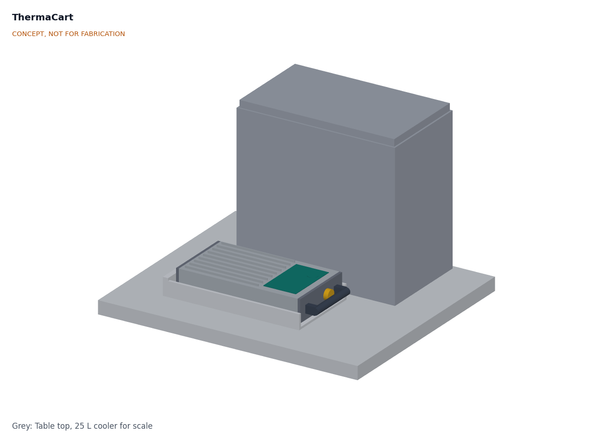
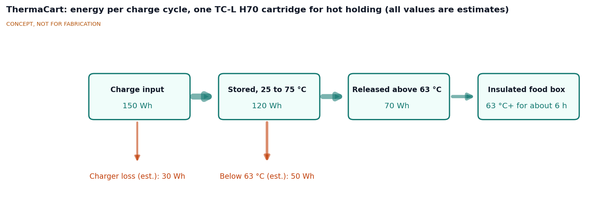
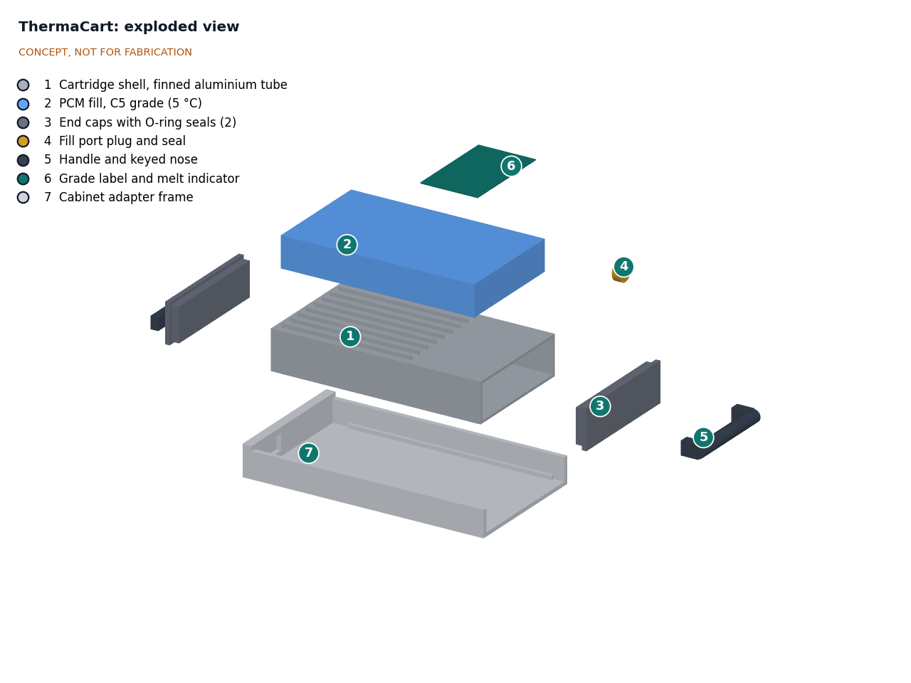
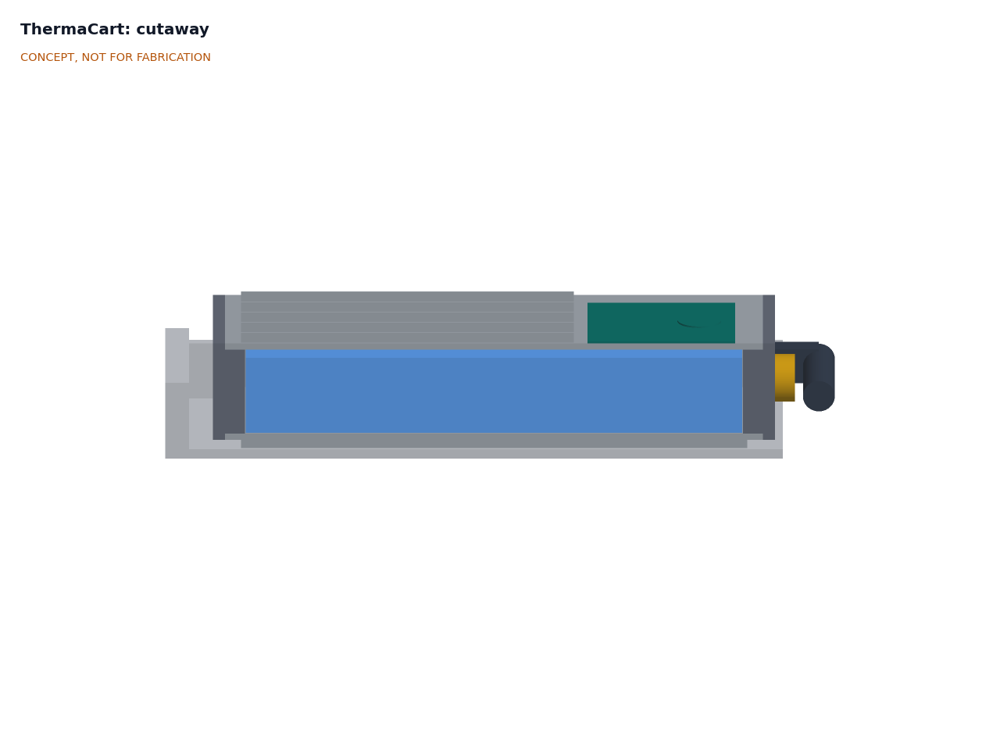

# ThermaCart design precis

## Summary

ThermaCart is a sealed aluminium cartridge, 322 x 152 x 61 mm, that holds about 1.1 kg of phase-change material (PCM) in one of three standard grades: C5 (melts at 5 °C, cold chain), C25 (25 °C, comfort) and H70 (70 °C, hot holding). It fits a GN 1/3 gastronorm slot, carries by a handle, shows its state through a sight window and locks into an adapter frame whose key accepts only the right grade. First-order estimates give 55 to 67 Wh of usable storage per cartridge, 2.6 kg filled and about $49 in parts. Two requirements are not met on paper (R5, PCM mass fraction; R14, hot handle on H70), and two are at risk or not met for the C5 grade (R3, R10). All numbers are estimates, and every design choice below is proposed, awaiting Amish.

*Figure 1. A TC-L cartridge (C5 grade) in its adapter frame on a table, with a 25 L cooler for scale.*

## How it works

1. **Charge.** The cartridge is put where the right temperature already exists: a freezer or cold room for C5, a refrigerator or night air for C25, an oven at 100 °C or less, a heating pad or a heat store for H70. The PCM freezes (C5, C25) or melts (H70) and stores latent heat at a nearly constant temperature.
2. **Carry and swap.** The sight window shows the state. The owner carries the cartridge to a cooler, food carrier, cabinet or heat exchanger and slides it into an adapter frame.
3. **Hold.** The host box leaks heat in (cold grades) or out (H70). The PCM absorbs or releases it while staying near its melt point, so the box contents stay in band until the PCM has fully changed phase.
4. **Return.** The discharged cartridge goes back to the charging point. Nothing is consumed; the fill is sealed for life.

*Figure 2. Energy per charge cycle for one H70 cartridge used for hot holding. All values are estimates: about 150 Wh in, 120 Wh stored between 25 and 75 °C, and about 70 Wh released above 63 °C. The remainder is released below 63 °C and is useful only for warming.*

## Standard grades

Table 1. Proposed grades (proposed, awaiting Amish)

| Grade | Melt point | Proposed fill (class) | Usable storage per TC-L (estimate) | Typical hosts | Colour and key |
| --- | --- | --- | --- | --- | --- |
| C5 | 5 °C | Organic paraffin, Rubitherm RT 5 HC class | About 55 Wh (198 kJ) | Produce and dairy coolers, a ColdPod-type box after qualification | Blue, key left |
| C25 | 25 °C | Organic paraffin, RT 25 HC class | About 61 Wh (220 kJ) | Electronics and battery cabinets, comfort cooling | Green, key centre |
| H70 | 70 °C | Organic paraffin, RT 70 HC class | About 67 Wh (242 kJ) | Insulated GN food carriers, keep-warm boxes | Red, key right |
| W0 (option) | 0 °C | Water with a nucleating agent | About 133 Wh (478 kJ) | Produce only; never for vaccines or medicines | White, key outer left |

Paraffins are proposed for the first three grades because they are chemically stable, non-corrosive to aluminium and cycle well ([PATH PCM study](https://media.path.org/documents/DT_pcm_summary_rpt1.pdf)). Salt hydrates would store roughly 1.5 to 2 times more per litre (estimate), but they supercool, separate and corrode aluminium ([corrosion study](https://www.researchgate.net/publication/229021530_Corrosive_effects_of_salt_hydrate_phase_change_materials_used_with_aluminium_and_copper)), so they are left for a later lined variant.

## Main components

Table 2. Main components. Numbers match the exploded view (Figure 3) and `bom/bom.csv`.

| # | Component | Proposed choice | Notes |
| --- | --- | --- | --- |
| 1 | Cartridge shell | 6063 aluminium rectangular tube, 152.4 x 50.8 x 3.18 mm (6 x 2 x 1/8 in), 270 mm long, with nine 5 mm fin strips bonded top and bottom | Stock section, no welding; fins double the air-side area |
| 2 | PCM fill | About 1.1 kg of the grade's PCM, filled hot to 90 % of the inner volume | Ullage for expansion; see Safety |
| 3 | End caps (2) | 12 mm aluminium plate with a 10 mm plug, FKM O-ring and six countersunk screws each | FKM (or NBR) resists paraffin; EPDM does not |
| 4 | Fill port plug | G 1/2 or G 3/4 plug with a bonded FKM seal in the handle-end cap | Fill, drain and recycling |
| 5 | Handle and keyed nose | Bent aluminium handle at one end with an insulating grip sleeve (for R14); key tab on the other end whose position codes the grade | Key positions in Table 1 |
| 6 | Grade label and melt indicator | Colour-coded polyester label with grade, fill, melt point and warnings; sight window over a small glass vial of the same PCM | Paraffin is opaque white when solid and clear when liquid |
| 7 | Cabinet adapter frame | Bent 1.5 mm aluminium sheet tray with side rails and a keyed stop | One per host slot; host designs copy its key |

*Figure 3. Exploded view. 1 shell, 2 PCM fill, 3 end caps, 4 fill port plug, 5 handle and keyed nose, 6 label and indicator, 7 adapter frame.*

*Figure 4. Section along the cartridge. The PCM (blue) fills about 90 % of the tube height; the top 10 % is ullage. The end-cap plugs, fins and label band are visible.*

## First-order numbers

All values are estimates for concept review and will be checked by calculation at TRL 3.

Table 3. First-order numbers

| Quantity | Estimate | Basis and assumptions | Requirement |
| --- | --- | --- | --- |
| Overall size | 322 x 152 x 61 mm | Massing model; 270 mm tube, 6 mm cap flanges, 22 mm handle, 10 mm key, 5 mm fins | R2 met (GN 1/3: 325 x 176 mm) |
| Inner volume | About 1.62 L | 146 x 44.4 mm inside the tube, 250 mm between cap plugs | |
| PCM mass | About 1.1 kg | 90 % fill at about 0.77 kg/L liquid density | |
| Usable storage | C5 55 Wh, C25 61 Wh, H70 67 Wh | 180, 200 and 220 kJ/kg within ±3 K, below Rubitherm's quoted 250, 230 and 260 kJ/kg ([Rubitherm](https://www.rubitherm.eu/en/productcategory/organische-pcm-rt)) | R3 not met for C5 |
| Shell and fittings | About 1.5 kg | Aluminium at 2.7 kg/L; caps pocketed to about 60 cm³ each | |
| Filled mass | About 2.6 kg | Shell plus fill | R4 met; R5 not met (about 42 % PCM) |
| Cold hold, two C5 in a 25 L cooler | About 8.1 h at 32 °C | 110 Wh over a 13.5 W leak (0.5 W/K x 27 K, estimate) | R10 at risk, no margin |
| Hot hold, one H70 in a GN carrier | About 6 h at 25 °C | About 70 Wh above 63 °C over an 11 W leak (0.25 W/K x 45 K, estimate) | R11 met |
| C5 recharge in a −18 °C freezer | About 4 to 8 h | Solidification of an 18 mm half-thickness of paraffin (k about 0.2 W/(m·K)) plus fin convection, first-order Stefan estimate | R12 at risk |
| H70 recharge on a 60 W pad | About 2.5 h | About 120 Wh stored at about 80 % transfer efficiency | R12 met |
| Energy density | About 21 to 26 Wh/kg | Usable storage over filled mass | |
| Parts cost | About $49 per cartridge, $15 per frame | Indicative prices, `bom/bom.csv` | R16 met, thin margin |

## Key design choices (all proposed, awaiting Amish)

1. **Envelope: GN 1/3 footprint from a stock tube.** Options were (a) a 6 x 2 in stock aluminium tube cut to fit a GN 1/3 slot; (b) the WHO PQS 0.6 L pack envelope, 190 x 120 x 34 mm ([WHO PQS E005](https://extranet.who.int/prequal/key-resources/documents/pqs-performance-specification-e005ip012-water-packs-use-icepacks-cool-packs)), which fits existing vaccine carriers but holds only about 0.5 kg; (c) a custom extruded finned profile. Recommendation: (a) for the first build, with (b) as a later small size (TC-S) and (c) only if volumes justify a die.
2. **Three paraffin grades first (C5, C25, H70), water as an option.** See Table 1. Recommendation: build C5 first because it has the lowest hazard and links to ColdPod.
3. **Mechanical grade keying.** A nose tab whose position depends on the grade, and a matching stop in each frame, so a frozen water or hot H70 cartridge cannot be put into a cold-chain box. Recommendation: adopt, and publish the key table as part of the open standard.
4. **Passive indicator.** A sight window over a vial of the same PCM shows solid or liquid without electronics. Alternative: a thermochromic strip (cheaper, reads surface temperature rather than state of charge). Recommendation: sight window.
5. **Fill hot, seal for life.** Filling as liquid at the top of the service temperature fixes the ullage at its smallest, so the PCM can only shrink afterwards and cannot pressurise the shell.
6. **Aluminium shell for paraffins, no HDPE.** Paraffin can swell and permeate polyethylene ([compatibility study](https://www.researchgate.net/publication/227717836_Compatibility_of_plastic_with_phase_change_materials_PCM)); aluminium is compatible and conducts heat to the fins. A lined or HDPE variant is kept for salt hydrates and water.

## Safety

> **Safety:** Paraffin fills are combustible. Never charge an H70 cartridge on an open flame, a gas ring or a hot plate, never above 100 °C, and keep all grades away from fire. If a cartridge leaks, stop using it; spilled liquid paraffin is slippery and burns.

> **Safety:** H70 cartridges reach about 75 °C and can burn skin. The handle must have an insulating grip (R14 is not met with bare aluminium), the label must carry a hot-surface warning, and hot cartridges should only be moved with the handle.

> **Safety:** Do not fill, refill or open a cartridge that is warm or under pressure. Fill only as described in the fill recipe, with the specified ullage. Never seal a cartridge that is only partly melted or at room temperature for an H70 grade, as later heating could pressurise it.

> **Safety:** A C5 cartridge charged in a freezer is below 0 °C when it comes out. Condition it until the sight window shows the first liquid before using it next to anything that must not freeze. ThermaCart is not qualified for vaccines or medicines, and the W0 water grade must never be used with them.

- Aluminium edges and fins are sharp after cutting: deburr all edges.
- A 2.6 kg cartridge dropped on a foot can injure: keep cartridges low in racks.

## Open questions for TRL 3

- Can the C5 grade reach R3 and R10? Options: a thinner wall, a slightly taller tube within the GN depth, or a denser PCM.
- R5: is a 42 % PCM fraction acceptable for the first build, with a custom extrusion later?
- Charging C5 in a domestic freezer overcools it; is a conditioning step acceptable, or should C5 be charged in a refrigerator at 0 to 2 °C?
- Seal design and O-ring material per grade, and the drop case for a filled cartridge (R6).
- Handle grip material for H70 and the handle temperature (R14).
- Which host first: a produce cooler with a trader partner, a GN food carrier with a caterer, or ColdPod?
- Does ThermaCart become a declared dependency of ColdPod or ZeerBox? Any change to those repos is Amish's decision.

Concept media: [blueprint sheet](../media/concept-blueprint.pdf), [interactive 3D model](../media/viewer.html).
