# ThermaCart prototype build plan

**Plan, not yet built.** How to build the first proof-of-concept prototype, component by component. Building and testing to it is TRL 4 work. Decisions still to be made are kept in the design decisions register ([docs/06-design-decisions.md](06-design-decisions.md)), not here.

## 1. What you are building

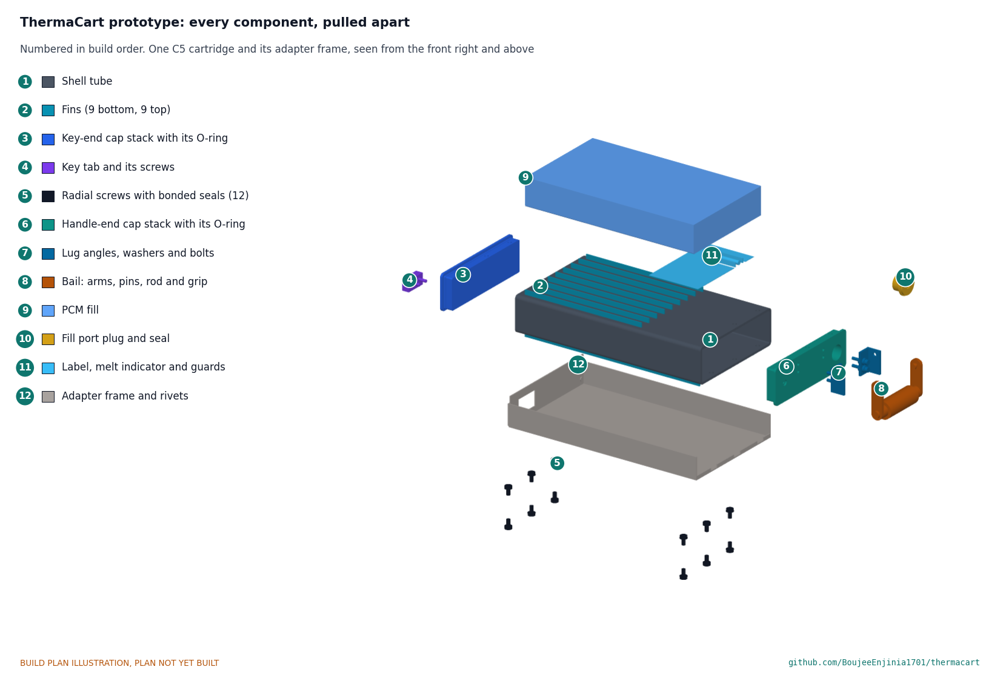

*Figure 1. Every component pulled apart and numbered in build order.*

The prototype is one TC-L cartridge in the cold-chain grade (C5) and one adapter frame for it. The cartridge is a 280 mm length of 6 x 2 in aluminium tube with eighteen thin fins bonded to its top and bottom, painted matte black, closed at each end by a cap made of three bonded aluminium plates and an O-ring, and filled with 1.10 kg of paraffin that melts at 5 °C. A folding bail on the handle end carries it, a key tab on the other end codes its grade, and a small clear tube of the same paraffin on top shows whether it is charged. The frame is a bent aluminium tray whose end stop has a slot that only the C5 key passes, with a low lip at its open end that holds out a cartridge of any other grade. Figure 1 shows the twelve components in the order you make or fit them. Eight are made in a small workshop: the shell tube, the fins, the two cap stacks, the key tab, the bail (lug angles, arms and rod), the melt indicator and the frame. The rest are bought: the paraffin, O-ring cord, fill plug, grip, label, washers and fixings. The work is sawing, filing, drilling and tapping aluminium, bonding with epoxy, painting, bending sheet on a hand brake and riveting; nothing needs milling or welding. The parts cost about $100 for the cartridge and frame, from the bill of materials.

> **Safety:** Paraffin is combustible: melt it only in a water bath on a thermostatic heater, never over a flame or on a hot plate, and never above 45 °C for the C5 grade. Cut aluminium edges and fin ends are sharp: deburr everything and wear gloves when handling the tube and sheet. Epoxy, etch primer and paint give off fumes: work in a ventilated space with gloves and eye protection. The filled cartridge weighs about 2.9 kg.

## 2. What changed to make it buildable

The concept showed what the cartridge does; some of its parts could not be made, fixed or sealed as drawn. Each change below keeps what the cartridge does, and all of them are recorded in decision record TCT-DDR-003, accepted by Amish on 2026-10-02.

*Table 1. Changes from the concept.*

| Component | The concept had | The buildable design has | Why |
| --- | --- | --- | --- |
| Fill port | A G 3/4 port whose hole cut through the O-ring | A G 1/2 aluminium plug, 56 mm toward the back, its thread 3.5 mm inside the O-ring line (Figure 12) | The port no longer opens a leak path past the seal |
| O-ring and cap plates | A 3 mm cord filling 94 % of its groove; square plate corners | A 2.5 mm cord filling 78 % of a groove 2.1 mm deep; plate corners rounded to match the tube (Figure 7) | Room for the cord to swell when hot; the plates clear the tube's inside corners |
| Radial cap screws | Countersunk screws on the PCM side of the O-ring, drawn as heads only | Button-head screws on bonded sealing washers, into tapped holes in the plug (Figure 8) | Each screw hole is sealed under its head |
| Cap plates | No fixing between the three plates | Bonded face to face and held by screws into blind holes in the plug | One rigid, sealed block; no hole reaches the PCM |
| Bail | Arms in front of the lugs, so they could not swing; lugs over the seal with no fixing | Bolted lug angles on phenolic washers; arms beside the angles on pins; rod screwed between the arms (Figures 14 and 16) | The bail folds, every joint is fixed, and only phenolic touches the bail |
| Key tab | No fixing | Two screws into the plug (Figure 10) | |
| Adapter frame | A stop 2 mm in front of the key, so the key never reached its slot; walls and stop overlapping in the corners | The key passes through the slot when seated; the walls fold round the stop and are riveted (Figures 21 and 22) | The frame has a seated position and can be bent from one sheet |
| Melt indicator | A 22 mm disc 2 mm thick over a vial | A clear tube of the same paraffin between two guards (Figure 19) | It can be made, fixed and protected |

## 3. Making the components

Make and check each component before the assembly step that needs it. Sizes are in millimetres. "Front" is the long face you see when the handle end is on your right and the key end on your left; "back" is the face opposite. Workshop tolerance is 0.5 mm unless a step says otherwise; drawings do not carry tolerances before TRL 4.

### 3.1 Shell tube

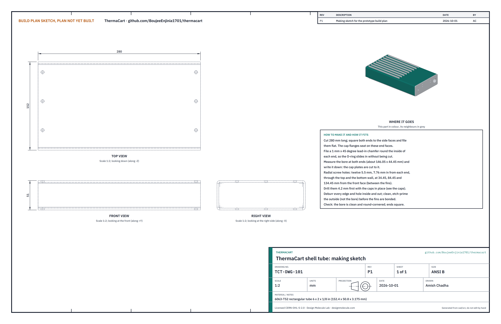

*Figure 2. Shell tube making sketch (TCT-DWG-101).*

**What it is and what it is made from.** The body of the cartridge, which holds the paraffin. 6063-T52 aluminium rectangular tube 152.4 x 50.8 mm with a 3.175 mm wall (6 x 2 x 1/8 in), cut to 280 mm.

**How to make it.**

1. Saw the tube to 280 mm. File both ends flat and square to the side faces: the cap flanges seat on them.
2. File a 1 mm lead-in chamfer round the inside of each end so the O-ring slides in without being cut.
3. Measure the bore at both ends with calipers (about 146.05 x 44.45 mm) and write it down; the cap plates are cut to it.
4. Mark the twelve radial screw holes: 7.76 mm in from each end, on the top and on the bottom wall, at 34.45, 84.45 and 134.45 mm from the front face. Centre punch them; they are drilled in section 3.3, with the caps in place.
5. Deburr every edge inside and out. Clean the outside with a solvent degreaser and etch-prime it (not the bore and not the end faces) ready for the fins.

**How it fits the parts next to it.** The fins bond to its top and bottom faces (Figure 4); the cap stacks slide into its ends until their flanges meet the end faces (Figure 7).

**Check before moving on.** Both ends square within 0.5 mm; the bore clean, its corners smooth.

### 3.2 Fins (make 9 long and 9 short)

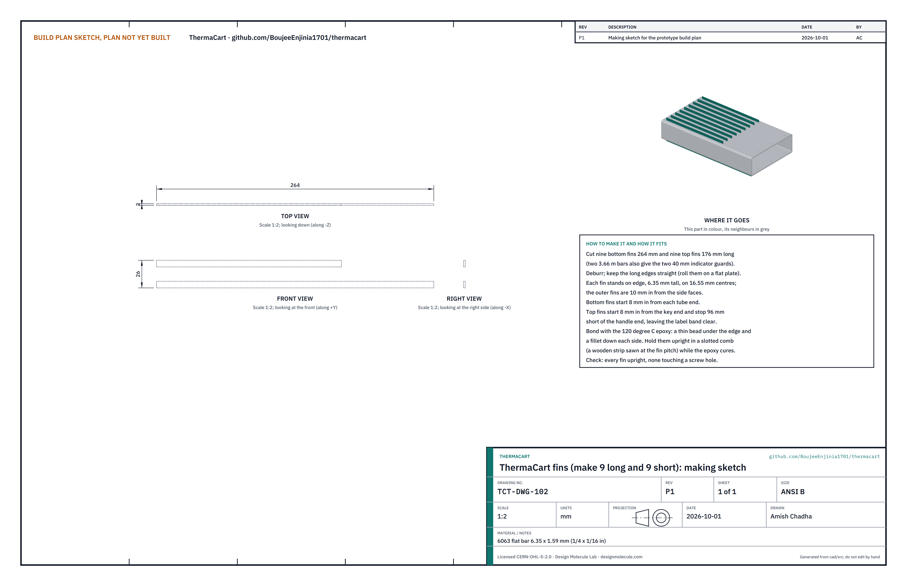

*Figure 3. Fin making sketch (TCT-DWG-102).*

**What it is and what it is made from.** Thin strips standing on edge on the top and bottom faces, which give the cartridge 44 % more outside area for heat to flow in and out. 6063 aluminium flat bar 6.35 x 1.59 mm (1/4 x 1/16 in).

**How to make it.**

1. Cut nine bottom fins 264 mm long and nine top fins 176 mm long from two 3.66 m bars. Keep two 40 mm offcuts for the indicator guards (section 3.9).
2. Deburr the ends and roll each strip on a flat plate to straighten it.
3. Make a comb: a wooden strip with nine saw cuts 1.6 mm wide on 16.55 mm centres, the outer cuts 10 mm in from the tube's side faces.

**How it fits the parts next to it.**

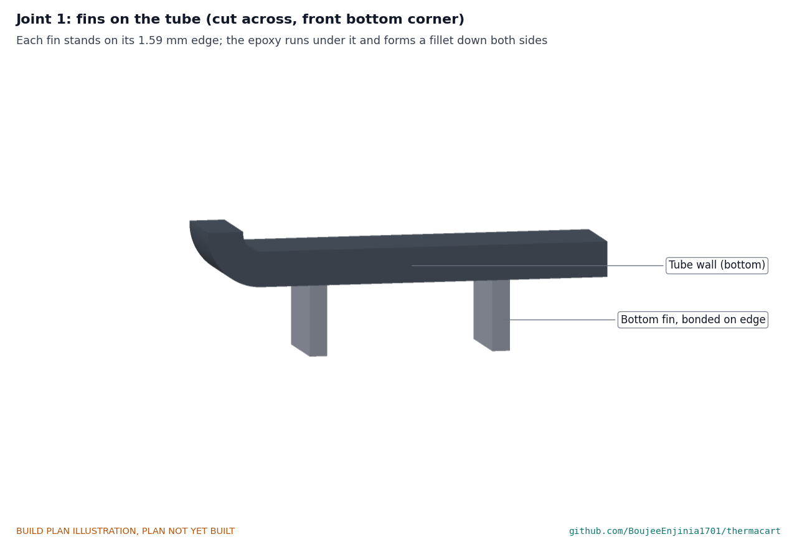

*Figure 4. Each fin stands on its edge on the tube face; the epoxy runs under it and forms a fillet down both sides.*

The bottom fins start 8 mm in from each tube end. The top fins start 8 mm in from the key end and stop 96 mm short of the handle end, which leaves the label band bare. Each is bonded with the 120 °C structural epoxy: a thin bead under the edge and a fillet about 2 mm high down each side, the fins held upright in the comb while the epoxy cures.

**Check before moving on.** Every fin upright and straight; no fin over a screw hole mark.

### 3.3 Key-end cap stack

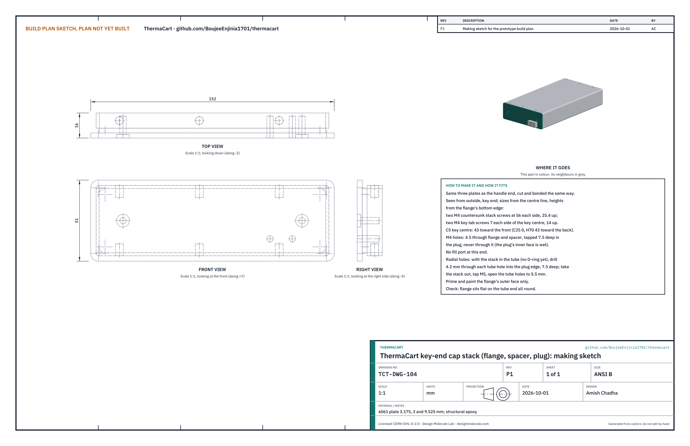

*Figure 5. Key-end cap stack making sketch (TCT-DWG-104).*

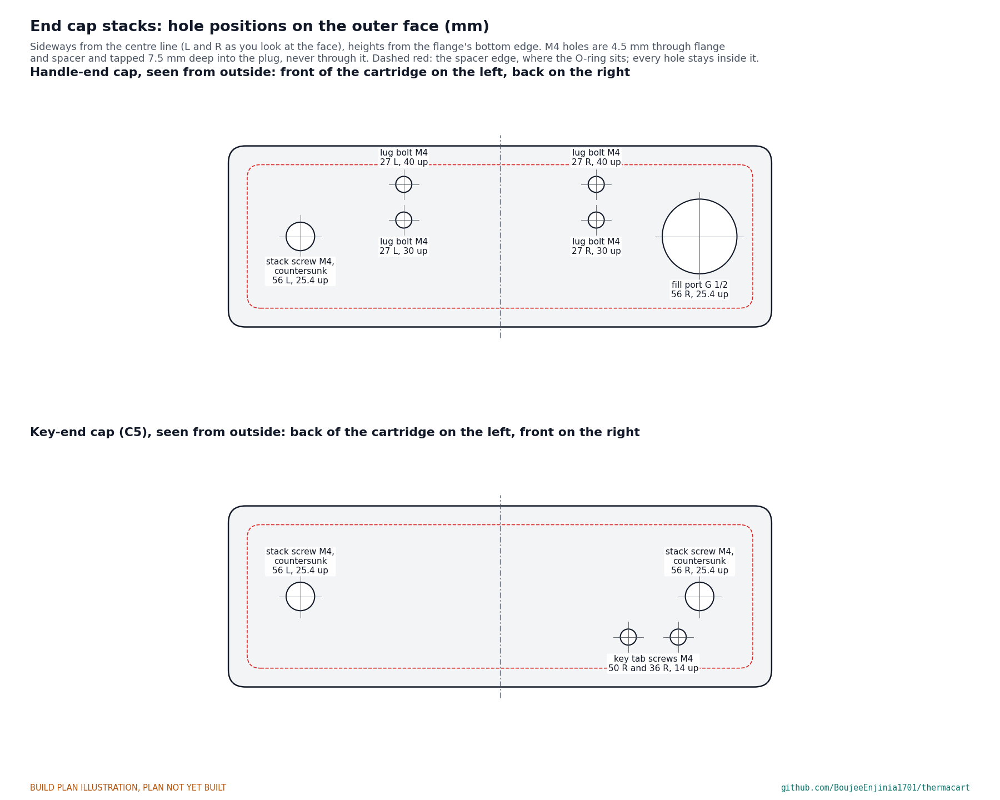

*Figure 6. Hole positions on the outer face of each cap stack.*

**What it is and what it is made from.** The closure at the key end: a flange that sits on the tube end, a thin gland spacer that the O-ring goes round, and a thick plug that fills the tube end, bonded into one block. 6061 aluminium plate 3.175, 3 and 9.525 mm thick, and the structural epoxy. Both cap stacks are made the same way; this one has no fill port.

**How to make it.**

1. Cut the flange to 152.4 x 50.8 mm and round its corners to 4.8 mm, to match the outside of the tube.
2. Cut the gland spacer to the measured bore less 4.2 mm each way (about 141.85 x 40.25 mm), corners rounded to 3.7 mm.
3. Cut the plug to the measured bore less 0.4 mm each way (about 145.65 x 44.05 mm), corners rounded to 2 mm. Try it in the tube end: it should slide in with a little play all round.
4. Abrade and clean the faces, then bond spacer and plug to the flange with the epoxy over their whole faces, centred, and clamp until cured. The epoxy also seals the joint lines.
5. Mark the holes from Figure 6, measured from the centre line and up from the flange's bottom edge: two stack screws 56 mm each side, 25.4 mm up; two key tab screws 36 and 50 mm toward the front, 14 mm up (for the C5 key).
6. Drill each hole 3.3 mm through flange and spacer and 7.5 mm into the plug, never through it: the plug's inner face touches the paraffin. Open the holes in flange and spacer to 4.5 mm and tap the plug M4. Countersink the two stack screw holes in the flange and fit two M4 x 12 countersunk screws with thread sealant.
7. Put the stack in the tube's key end without its O-ring and clamp it. Drill 4.2 mm through each of the six marked holes in the tube walls into the plug edge, 7.5 mm deep. Take the stack out, tap the plug holes M5 and open the tube holes to 5.5 mm. Deburr.
8. Mask the spacer, the plug and the flange's inner face, then prime and paint the flange's outer face only.

**How it fits the parts next to it.**

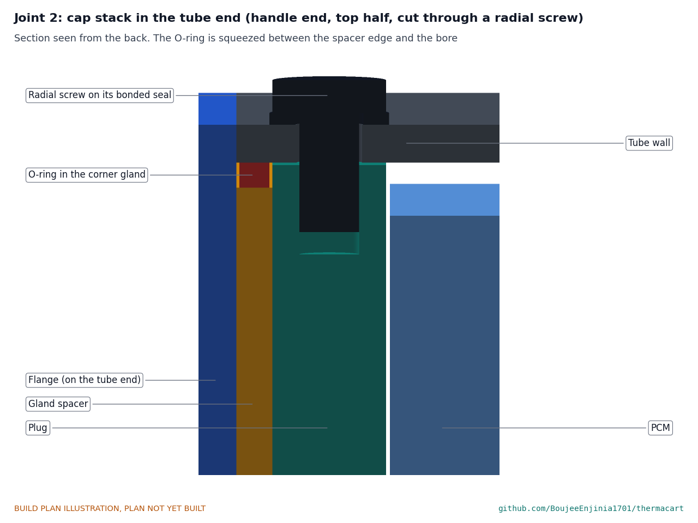

*Figure 7. Section through the handle end; the key end is the same. The O-ring is squeezed between the spacer edge and the bore; the flange stops on the tube end.*

The flange sits flat on the tube end all round. The O-ring, a 2.5 mm FKM cord spliced into a loop, sits round the spacer and is squeezed 0.4 mm between the spacer edge and the bore. The plug is 0.2 mm clear of the bore.

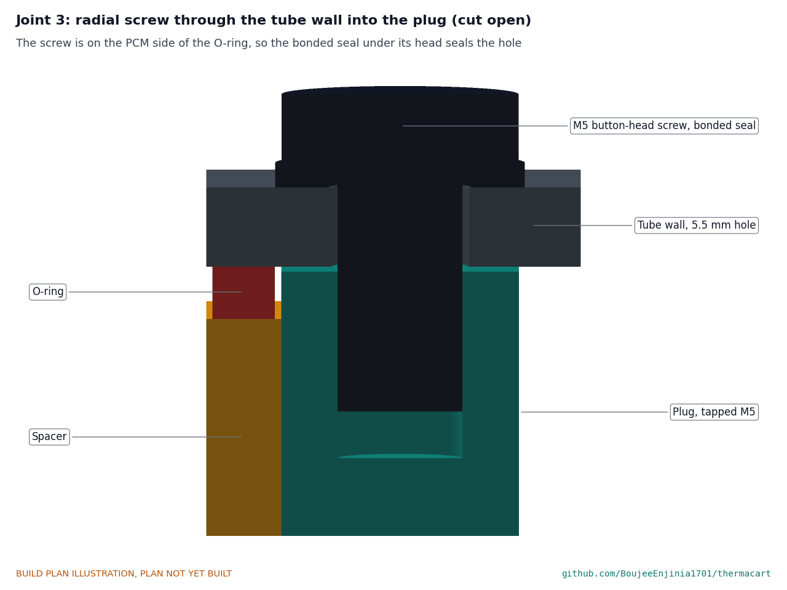

*Figure 8. Six radial screws hold each cap: through the tube wall into the plug edge, each on a bonded sealing washer.*

**Check before moving on.** Without its O-ring the stack slides in until the flange meets the tube end, and all six tube holes line up with the tapped holes.

### 3.4 Key tab

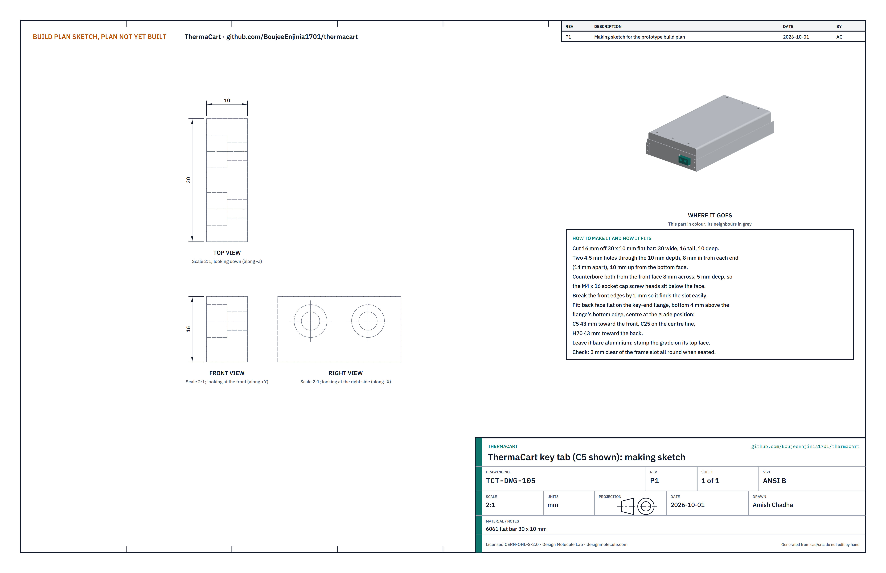

*Figure 9. Key tab making sketch (TCT-DWG-105).*

**What it is and what it is made from.** The block on the nose whose position across the cartridge codes its grade, so that only the right frame accepts it. 6061 aluminium flat bar 30 x 10 mm.

**How to make it.**

1. Cut a 16 mm length of the bar: the tab is 30 wide, 16 tall and 10 deep.
2. Drill two 4.5 mm holes through the 10 mm depth, 8 mm in from each end (14 mm apart) and 10 mm up from the bottom face.
3. Counterbore both holes from the front face, 8 mm across and 5 mm deep.
4. Break the front edges by 1 mm so the tab finds the frame slot easily. Stamp "C5" on its top face; leave it bare.

**How it fits the parts next to it.**

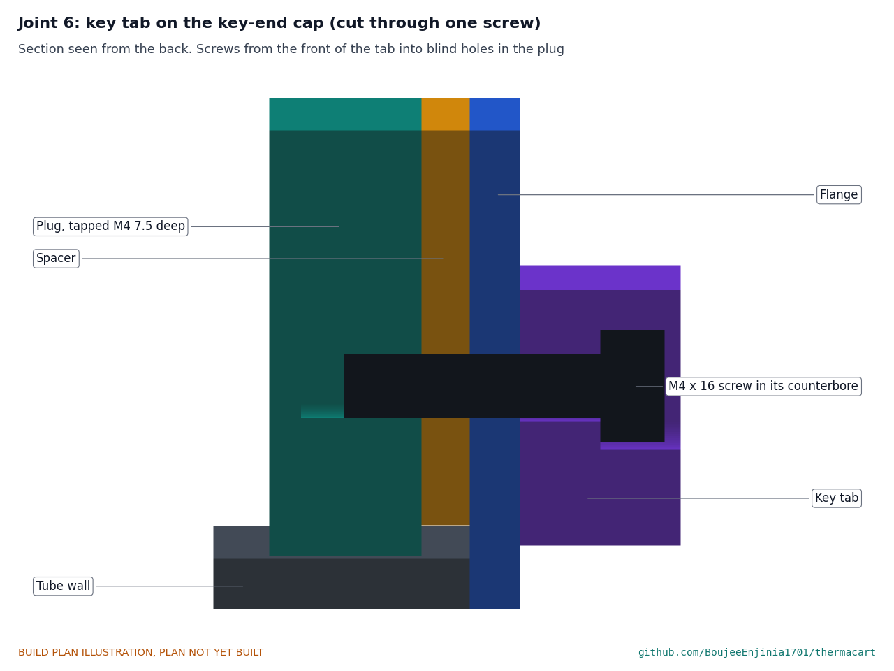

*Figure 10. Section through one key screw: from the front of the tab, through flange and spacer, into a blind hole in the plug.*

The back face sits flat on the key-end flange, its bottom 4 mm above the flange's bottom edge and its centre 43 mm toward the front (the C5 position; C25 is on the centre line and H70 is 43 mm toward the back). Two M4 x 16 socket cap screws with thread sealant hold it; their heads sit 1 mm below the front face.

**Check before moving on.** The tab is square to the flange and the screw heads are below its face.

### 3.5 Handle-end cap stack

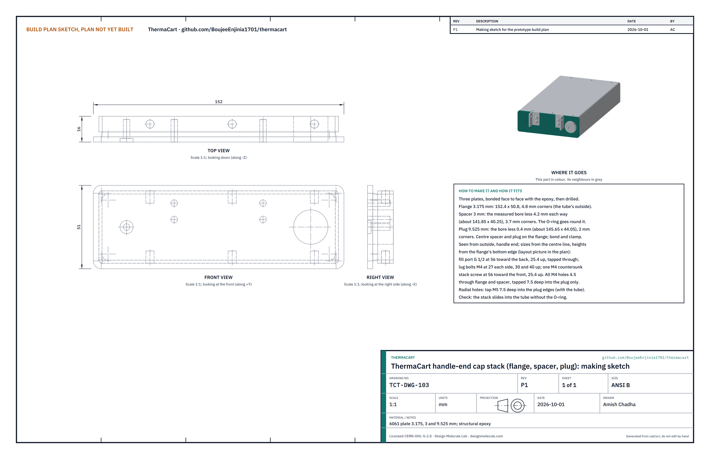

*Figure 11. Handle-end cap stack making sketch (TCT-DWG-103).*

**What it is and what it is made from.** The closure at the handle end, made like the key-end stack (section 3.3), which also carries the fill port and the bail.

**How to make it.**

1. Cut and bond the three plates as section 3.3, steps 1 to 4.
2. Mark the holes from Figure 6 (handle end, seen from outside): the fill port 56 mm toward the back, 25.4 mm up; four lug bolt holes 27 mm each side of the centre line, 30 and 40 mm up; one stack screw 56 mm toward the front, 25.4 mm up.
3. Drill the fill port through the whole stack with the G 1/2 tapping drill (18.6 mm) and tap it G 1/2 straight through. Spot-face the flange round it so the bonded seal sits flat.
4. Drill and tap the lug bolt and stack screw holes as section 3.3, step 6: 4.5 mm through flange and spacer, M4 7.5 mm deep in the plug. Fit the countersunk stack screw.
5. Drill the six radial holes with the stack in the handle end of the tube, as section 3.3, step 7.
6. Paint the flange's outer face as section 3.3, step 8, masking a 30 mm circle round the fill port.

**How it fits the parts next to it.** It fits the tube exactly as the key-end stack does (Figures 7 and 8). The fill plug seals on the flange face:

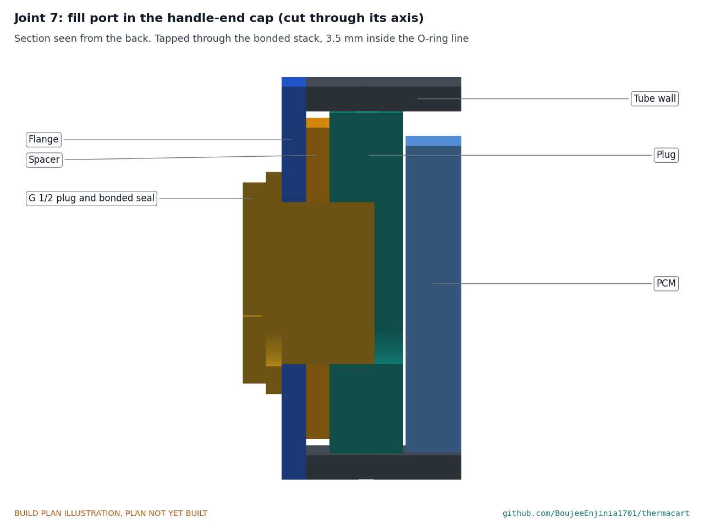

*Figure 12. Section through the fill port. The plug's bonded seal sits on the flange; its thread is 3.5 mm inside the O-ring line.*

**Check before moving on.** A G 1/2 plug screws in by hand all the way; the lug bolt holes are blind (a wire does not pass into the tube).

### 3.6 Lug angles (make 2, a left and a right)

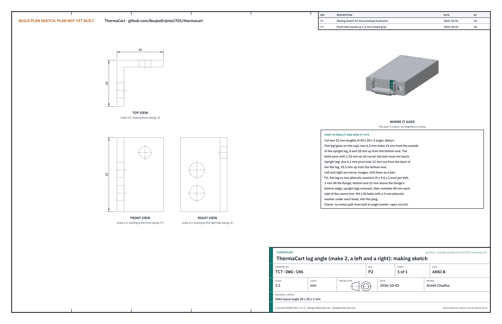

*Figure 13. Lug angle making sketch (TCT-DWG-106).*

**What it is and what it is made from.** The two brackets the bail swings on, bolted to the handle-end cap through a thermal break so the bail stays cool when the cartridge is hot. 6063 aluminium equal angle 20 x 20 x 3 mm.

**How to make it.**

1. Cut two 32 mm lengths and deburr them.
2. Flat leg (the one that goes against the cap): two 6.5 mm holes, 13 mm from the outside face of the upright leg, 8 and 18 mm up from the bottom end.
3. Upright leg: one 5.2 mm pivot hole, 12 mm out from the back of the flat leg and 25.5 mm up from the bottom end.
4. The two are mirror images: clamp them back to back and drill them together.

**How it fits the parts next to it.**

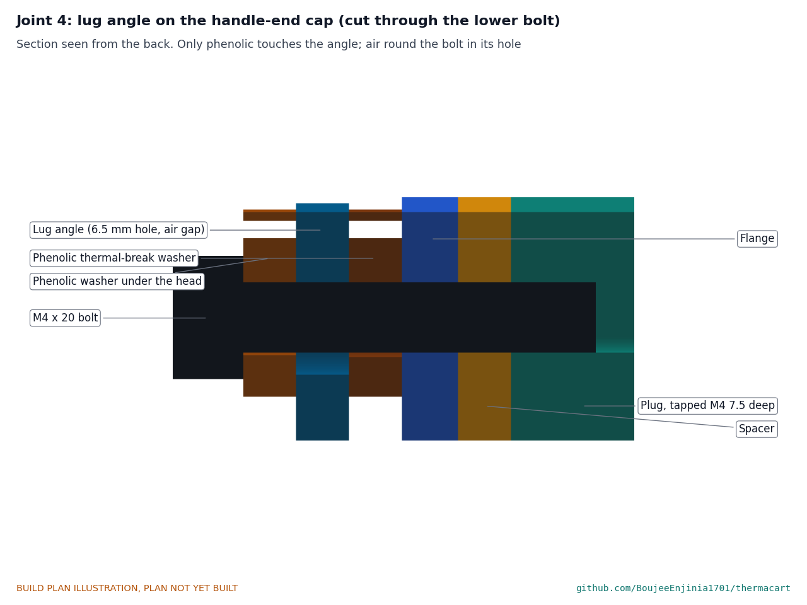

*Figure 14. Section through one lug bolt. Only phenolic touches the angle: two washers under it and one under the bolt head, and air round the bolt.*

Each angle stands 3 mm off the flange on two phenolic washers (9 mm across, 4.5 mm hole, 3 mm thick), its bottom end 22 mm above the flange's bottom edge and the outside of its upright leg 40 mm from the centre line, upright legs facing outward. Two M4 x 20 socket cap screws, each with a 3 mm phenolic washer under its head, pass through the 6.5 mm holes with 1.25 mm of air all round and screw into the plug with thread sealant. The bolt must not touch the angle: that would carry heat straight into the bail.

**Check before moving on.** With a meter, no continuity between each bolt head and its angle.

### 3.7 Bail arms (make 2)

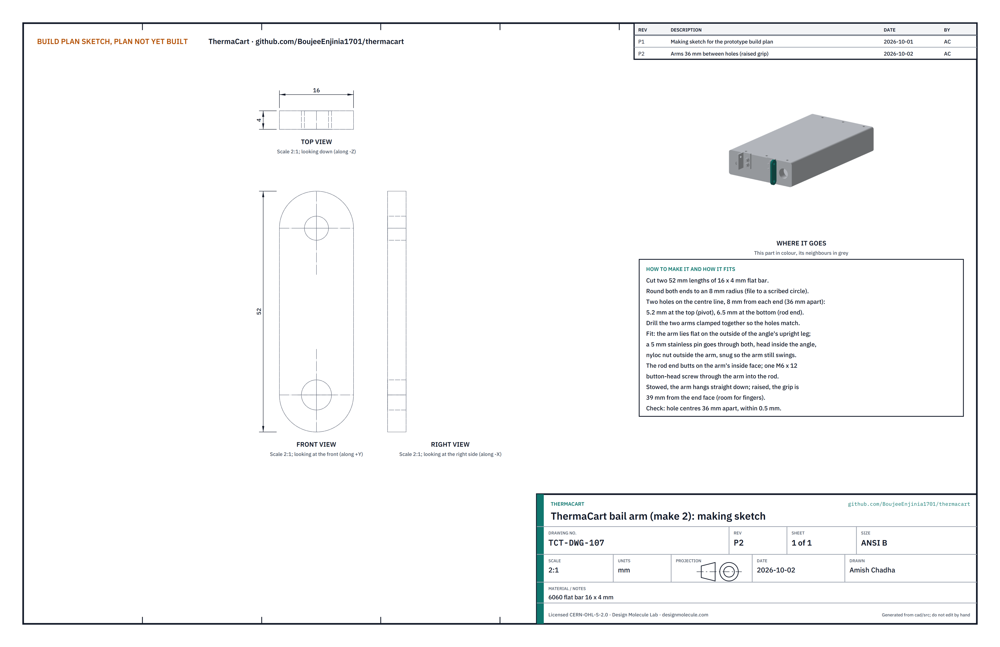

*Figure 15. Bail arm making sketch (TCT-DWG-107).*

**What it is and what it is made from.** The two side links of the folding bail. 6060 aluminium flat bar 16 x 4 mm.

**How to make it.**

1. Cut two 52 mm lengths and round both ends to an 8 mm radius.
2. Drill two holes on the centre line, 8 mm from each end (36 mm apart): 5.2 mm at the top (the pivot) and 6.5 mm at the bottom (the rod end). Drill the two arms clamped together.

**How it fits the parts next to it.**

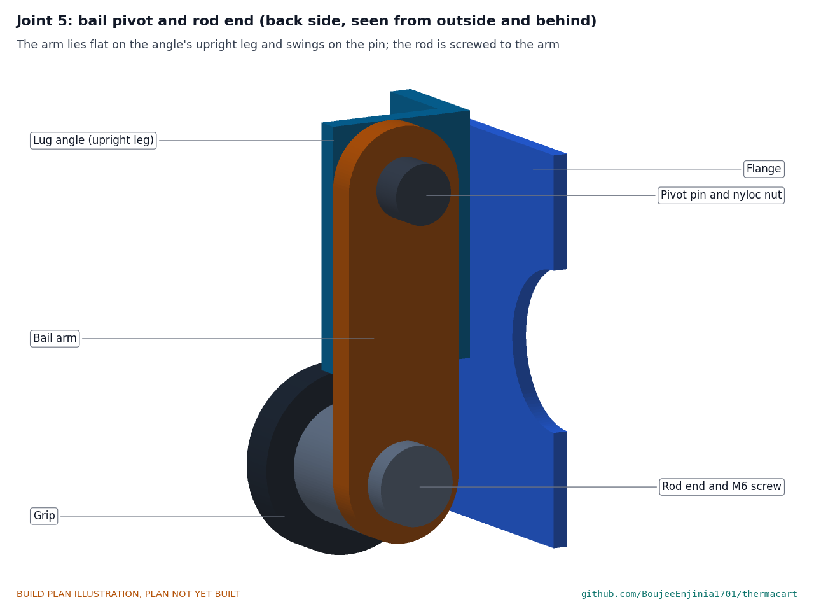

*Figure 16. The arm lies flat on the outside of the angle's upright leg and swings on the pin; the rod is screwed to the arm.*

A 5 mm stainless pin passes through the angle and the arm, its head inside the angle and a nyloc nut outside the arm, snug enough that the arm still swings. The rod end butts on the arm's inside face and an M6 x 12 button-head screw through the arm holds it. Stowed, the arm hangs straight down; swung out level, the grip is 39 mm from the end face, room for fingers.

**Check before moving on.** Hole centres 36 mm apart, within 0.5 mm, on both arms.

### 3.8 Bail rod

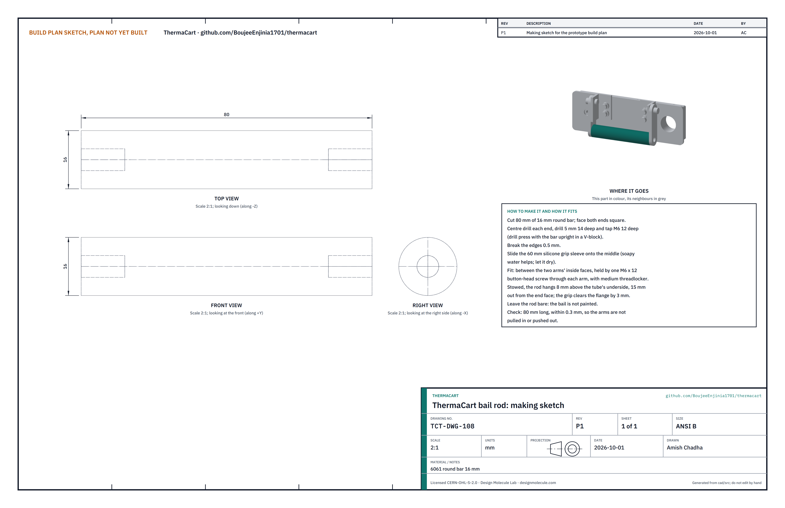

*Figure 17. Bail rod making sketch (TCT-DWG-108).*

**What it is and what it is made from.** The handle the user holds, with a silicone grip. 6061 aluminium round bar 16 mm and a silicone sleeve 24 mm outside, 60 mm long.

**How to make it.**

1. Cut 80 mm of bar and face both ends square.
2. With the bar upright in a V-block in the drill press, centre drill each end, drill 5 mm 14 mm deep and tap M6 12 mm deep.
3. Break the edges by 0.5 mm. Slide the grip sleeve onto the middle with soapy water and let it dry. Leave the rod bare: the bail is not painted.

**How it fits the parts next to it.** Between the arms' inside faces on two M6 x 12 button-head screws with medium threadlocker (Figure 16). Stowed, it hangs 11.5 mm above the tube's underside and 15 mm out from the end face; the grip clears the flange by 3 mm, and its underside is about 2 mm higher than the top of the frame's lip, so the grip never catches on it.

**Check before moving on.** 80 mm long within 0.3 mm, so the arms are neither pulled in nor pushed out.

### 3.9 Melt indicator and guards

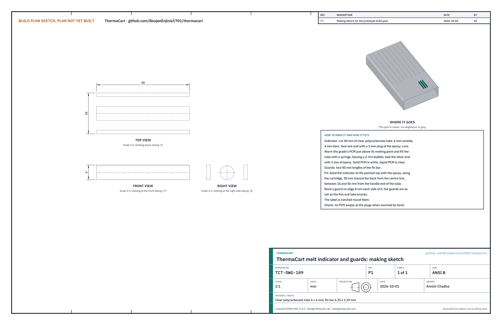

*Figure 18. Melt indicator and guards making sketch (TCT-DWG-109).*

**What it is and what it is made from.** A small sealed tube of the same paraffin on the top of the cartridge: white when it is solid (charged), clear when it has melted. Clear polycarbonate tube 6 mm outside and 4 mm bore, and two offcuts of the fin bar.

**How to make it.**

1. Cut 40 mm of the clear tube. Seal one end with a 3 mm plug of the epoxy and let it cure.
2. Warm a little of the C5 paraffin just above its melting point and fill the tube with a syringe, leaving a 2 mm bubble. Seal the other end with 3 mm of epoxy.
3. Cut the two guards: 40 mm lengths of the fin bar.

**How it fits the parts next to it.**

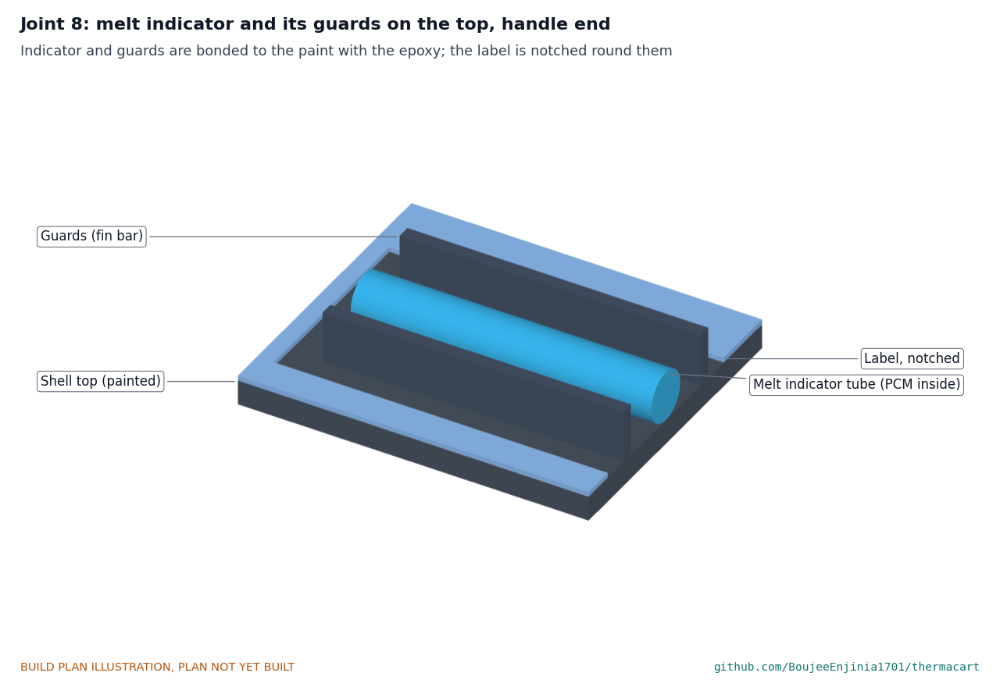

*Figure 19. The indicator and its guards are bonded to the painted top; the label is notched round them.*

The indicator lies along the cartridge on the painted top, 30 mm toward the back from the centre line, between 16 and 56 mm from the handle end of the tube, bonded with the epoxy. A guard stands on edge 8 mm each side of it, bonded the same way; the guards are as tall as the fins and take knocks.

**Check before moving on.** Warmed in the hand, the paraffin turns clear and no paraffin weeps at either plug.

### 3.10 Adapter frame

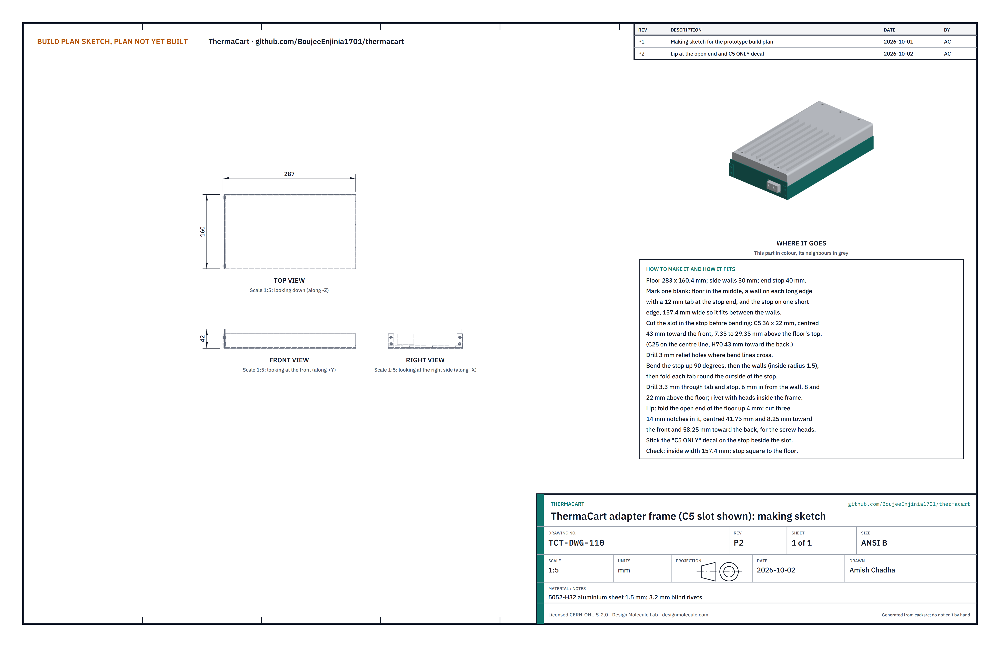

*Figure 20. Adapter frame making sketch (TCT-DWG-110).*

**What it is and what it is made from.** The tray that goes in the host's slot and accepts only C5 cartridges. 5052-H32 aluminium sheet 1.5 mm, four 3.2 mm aluminium blind rivets and a printed "C5 ONLY" vinyl decal.

**How to make it.**

1. Mark one blank: the floor 283 x 160.4 mm in the middle, including a 4 mm strip for the lip at the open end; a 30 mm wall on each long edge, each with a 12 mm tab at the stop end; and the 40 mm stop on one short edge, 157.4 mm wide so it bends up between the walls.
2. Before bending, cut the slot in the stop: 36 mm wide and 22 mm tall, centred 43 mm toward the front, from 7.35 to 29.35 mm above the floor's top face. File it smooth.
3. Drill 3 mm relief holes where bend lines cross. Bend the stop up 90°, then the walls (inside radius 1.5 mm), then fold each tab round the outside of the stop.
4. Drill 3.3 mm through each tab and the stop, 6 mm in from the wall, 8 and 22 mm above the floor. Fit the rivets from inside, heads inside the frame.
5. Fold the 4 mm strip at the open end up 90° to make the lip. Cut three 14 mm notches in it for the screw heads under the cartridge: centred 41.75 mm and 8.25 mm toward the front of the centre line and 58.25 mm toward the back.
6. Stick the "C5 ONLY" decal on the outside of the stop, just above the slot.

**How it fits the parts next to it.**

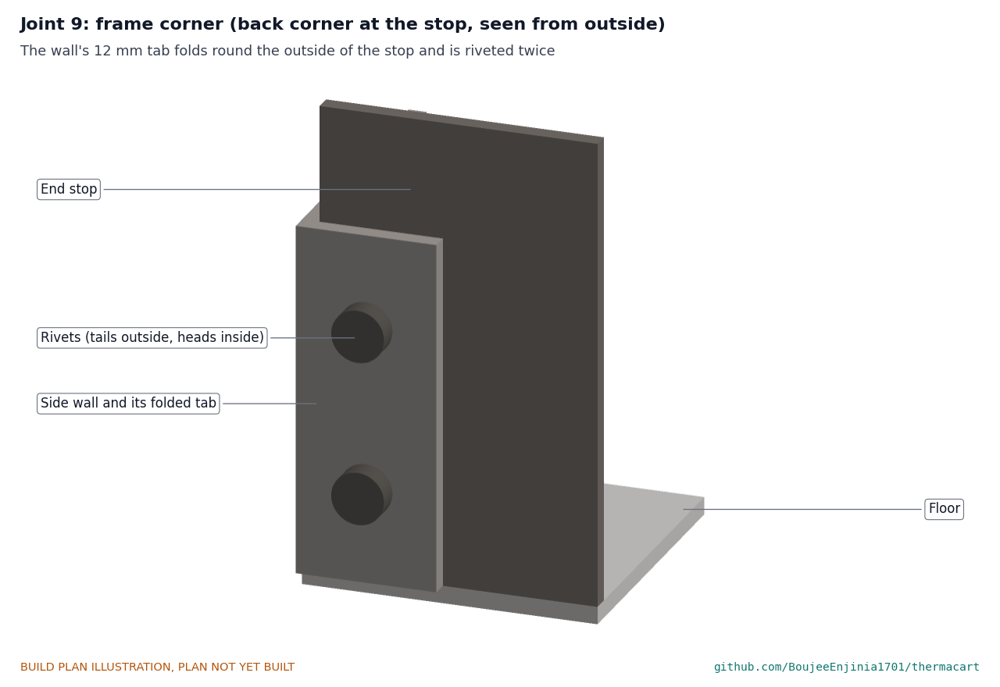

*Figure 21. The wall's tab folds round the outside of the stop and is riveted twice.*

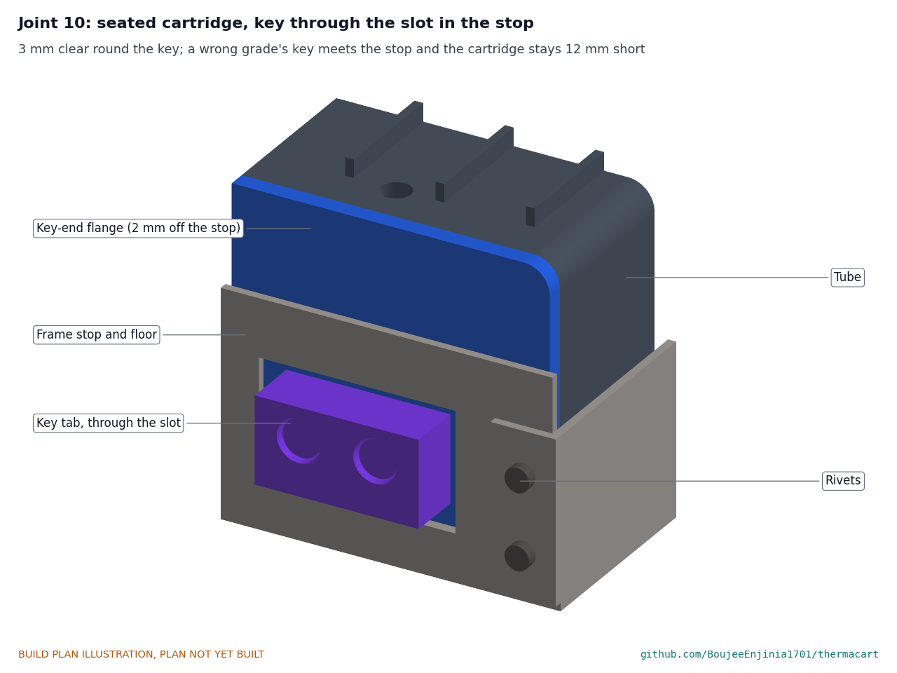

*Figure 22. Seated, the key passes through the slot with 3 mm all round and the nose flange stops 2 mm from the stop.*

The cartridge stands on its bottom fins on the floor, 2.5 mm from each wall, and the ends of its bottom fins sit 3 mm inside the lip. A cartridge of another grade meets the stop with its key 8 mm short of seated, so its bottom fins cannot drop behind the lip: they rest on top of it, and that cartridge sits with its handle end 4 mm high and plainly out of place.

**Check before moving on.** Inside width 157.4 mm; the stop square to the floor; the rivet heads 1 mm or less proud inside; the lip 4 mm tall and square to the floor.

### 3.11 Bought components

Buy to specification, not brand. Line numbers are those of the bill of materials.

- **PCM fill (line 2).** 1.10 kg of organic paraffin that melts at 5 to 6 °C (Rubitherm RT 5 HC class), with its datasheet, plus about 10 g for the indicator.
- **O-ring cord (line 3).** FKM (or NBR) cord 2.5 mm, about 0.8 m, and a splicing kit; not EPDM, which paraffin swells.
- **Fill plug (line 4).** G 1/2 plug with collar and hex socket (DIN 908 class) in anodised aluminium, and a G 1/2 FKM bonded sealing washer; anti-seize for the thread.
- **Grip, phenolic and pins (line 5).** Silicone sleeve 24 mm outside, 16 mm bore, 60 mm long; phenolic laminate sheet 3 mm for eight washers; two 5 mm stainless pins (or M5 shoulder bolts) with nyloc nuts.
- **Label and marking (line 6).** Colour-coded C5 polyester label with grade, fill, melt point and warnings, and the charging instruction: freezer, then about 4.2 h of conditioning, as a required step; notched for the indicator. A cut vinyl stencil for the side marking "ThermaCart, TC-L C5" and white high-temperature paint.
- **Frame decal (line 7).** A printed "C5 ONLY" vinyl decal for the stop.
- **Fixings (line 8).** A2 stainless: twelve M5 x 10 button-head screws (ISO 7380) with twelve M5 FKM bonded sealing washers; three M4 x 12 countersunk screws; two M4 x 16 and four M4 x 20 socket cap screws; two M6 x 12 button-head screws. Structural epoxy rated to 120 °C or more; thread sealant; medium threadlocker.
- **Finish (line 1).** Etch primer and matte black high-temperature paint rated well above 90 °C; blue high-temperature paint and 18 mm masking tape for the grade band.
- **Rivets (line 7).** Four 3.2 mm aluminium blind rivets for 3 mm grip.

## 4. Putting it together

In each picture the parts already fitted are grey and the part being fitted is in colour, with an arrow showing the way it goes in.

### Step 1: bottom fins onto the tube

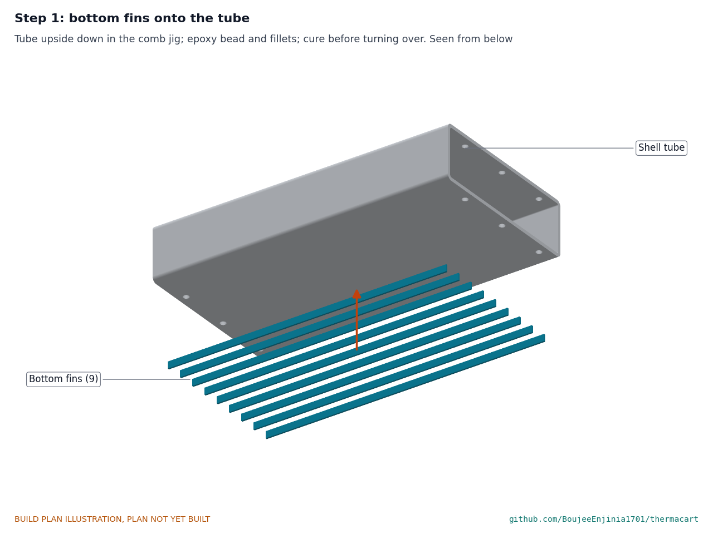

Stand the tube upside down on the bench with the comb across it. Lay an epoxy bead along each fin line, set the nine bottom fins in the comb, form the fillets and let the epoxy cure fully before turning the tube over.

### Step 2: top fins onto the tube, then the finish, grade band and marking

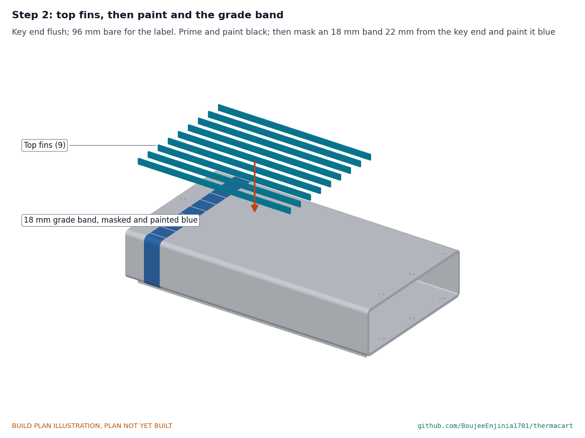

Bond the nine top fins the same way, flush with the bottom fins at the key end. When cured, mask the bore and the end faces, prime and paint the shell and fins matte black, and cure the paint as its maker says, before any paraffin is near it. Then mask an 18 mm band round the nose end, starting 22 mm from the key-end face, and paint it blue, the C5 grade colour. Last, paint the side marking "ThermaCart, TC-L C5" in white on the front face through the stencil.

### Step 3: key tab onto the key-end cap

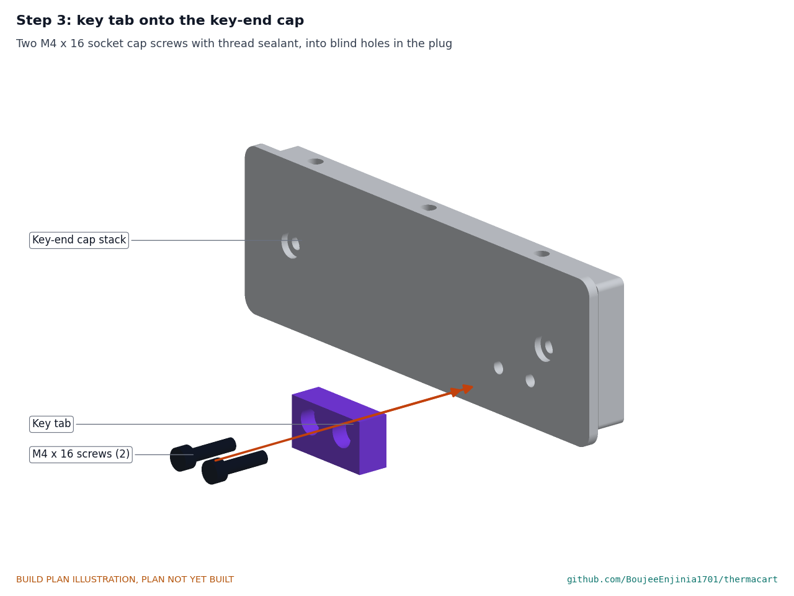

Two M4 x 16 socket cap screws with thread sealant into the blind holes in the plug, tight.

### Step 4: key-end cap into the tube

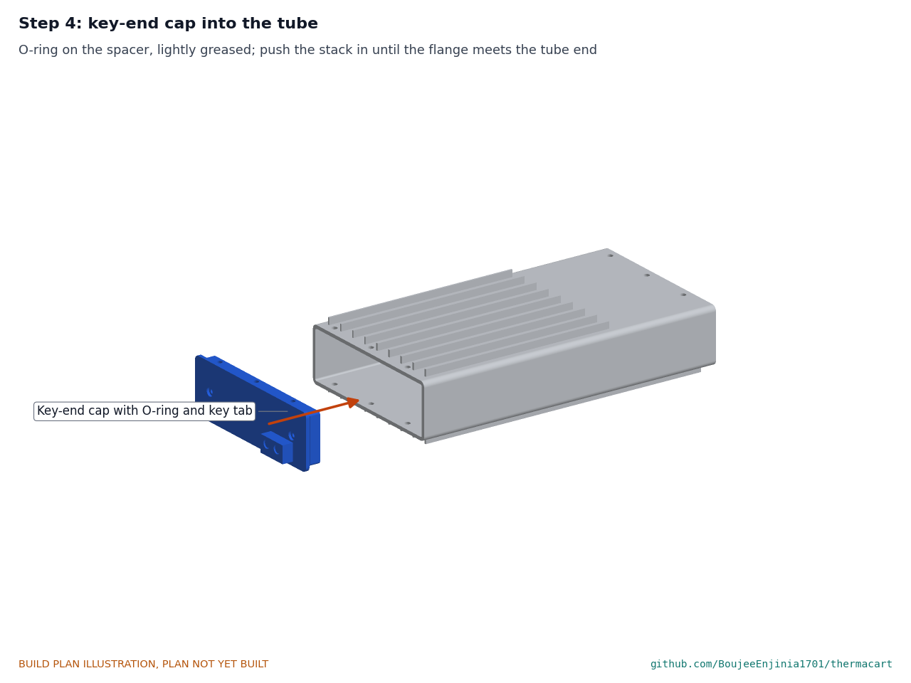

Splice the O-ring, stretch it round the spacer and wipe it with a trace of silicone grease. Push the stack into the key end, key tab outward and on the front side, until the flange meets the tube end.

### Step 5: radial screws at the key end

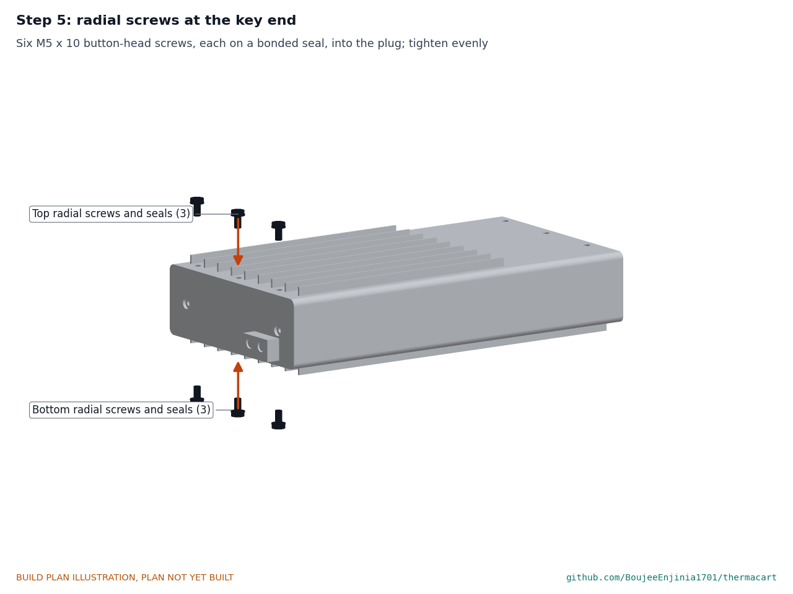

Six M5 x 10 button-head screws, each on a bonded sealing washer, into the plug; tighten evenly, top and bottom alternately.

### Step 6: lug angles onto the handle-end cap

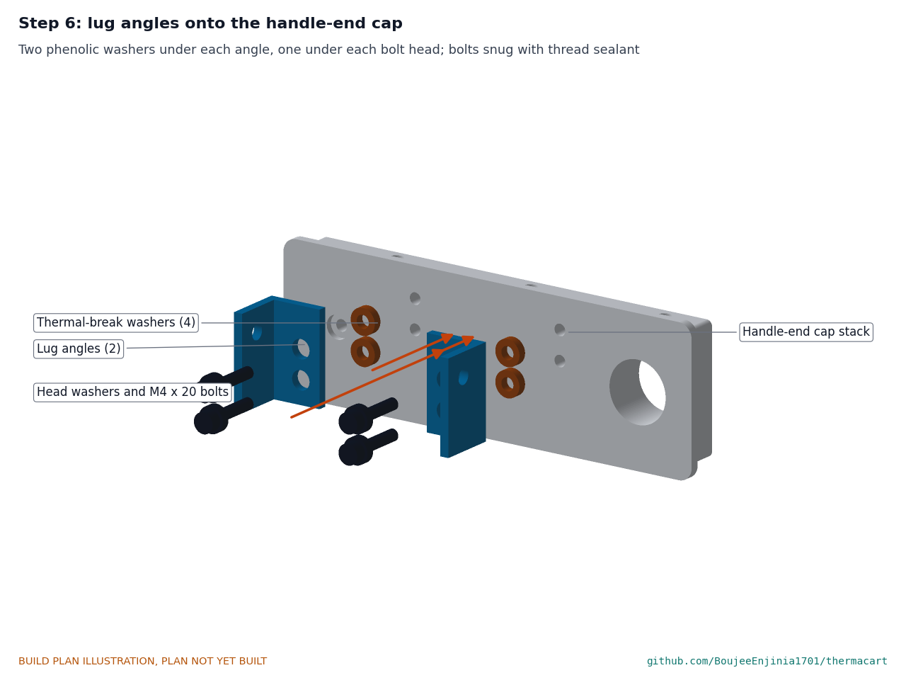

Two phenolic washers under each angle and one under each bolt head; four M4 x 20 bolts with thread sealant, snug. Check the meter test of section 3.6.

### Step 7: handle-end cap into the tube

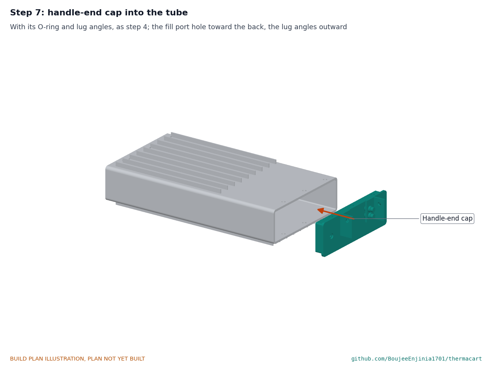

As step 4, with the fill port toward the back and the lug angles standing outward.

### Step 8: radial screws at the handle end

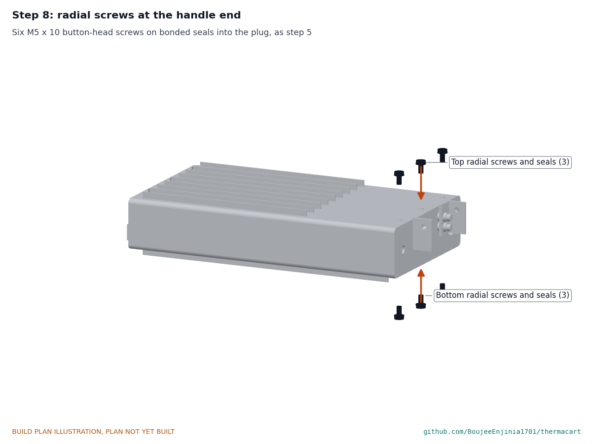

As step 5. **Hold point:** the leak check of section 5 passes before any paraffin goes in.

### Step 9: bail onto the lug angles

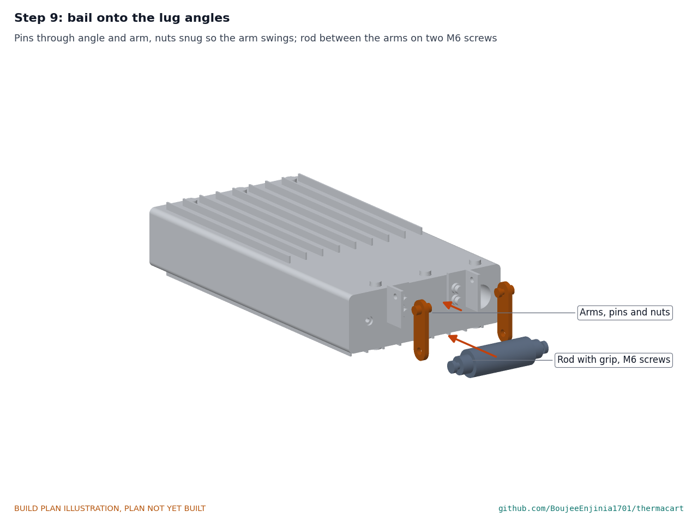

Pin each arm to its angle, pin head inside and nyloc nut outside, snug so the arm swings. Fit the rod between the arms on the two M6 screws with threadlocker. Swing the bail through its travel: it must not touch the fill port, the cap or the top.

### Step 10: fill with paraffin, then plug the port

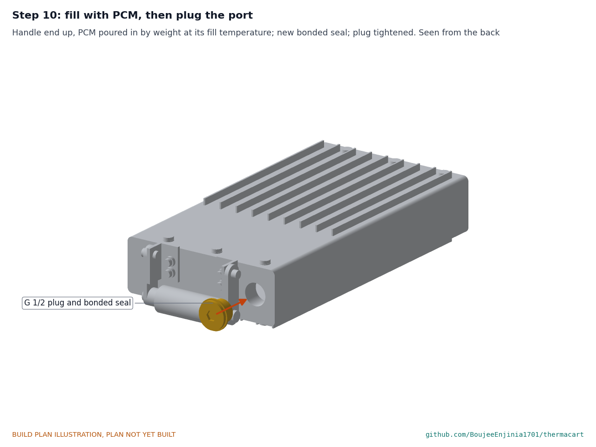

Melt the C5 paraffin in a water bath and bring it to 45 °C. Warm the empty cartridge to 45 °C in the same bath (port plugged) or a warm room, then stand it on its key end in a support box with the port up. Pour in 1.104 kg through a funnel, checked on a scale; this leaves 10 % of the space as air. Wipe the port, fit the plug on a new bonded seal with anti-seize and tighten it. **Hold point:** safety stop S3.

### Step 11: melt indicator, guards and label onto the top

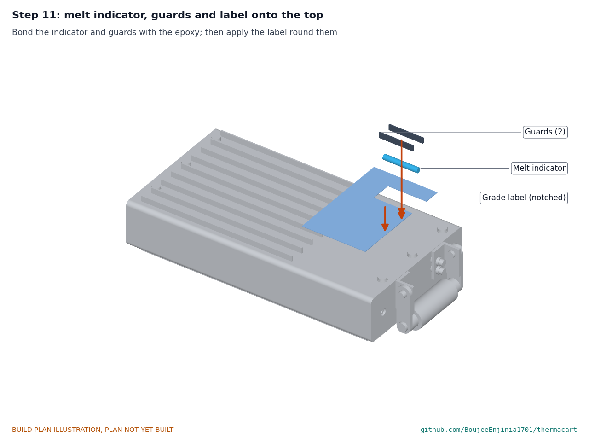

Bond the indicator and the two guards to the painted top with the epoxy (section 3.9). When cured, apply the label round them.

### Step 12: cartridge into the adapter frame

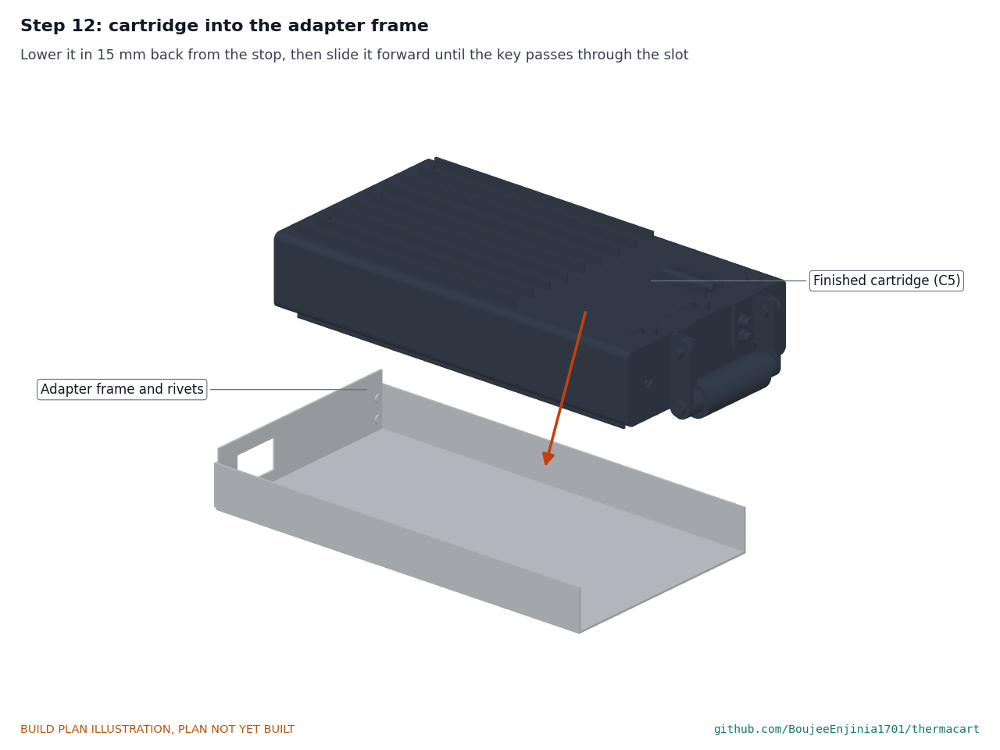

Hold the cartridge nose down with its handle end above the lip, slide it forward until the key passes through the slot, then lower the handle end so the bottom fins drop behind the lip. The nose stops 2 mm from the stop.

## 5. First checks

These are the checks a TRL 4 test report would record; this plan only lists them. Requirement numbers are those of TCT-REQ-001.

*Table 2. First checks.*

| Check | Requirement | How | Pass when |
| --- | --- | --- | --- |
| Envelope | R2 | Measure with the bail stowed; try it in a GN 1/3 pan slot | 323.4 x 152.4 x 63.5 mm or less; it drops in |
| Leak check, empty | R6 | Before filling, warm the sealed empty cartridge in a 45 °C water bath for 10 min with the port plugged | No bubbles at any cap, screw or plug |
| Leak check, filled | R6 | Stand the filled cartridge on each end in turn for 1 h at 45 °C on absorbent paper | No paraffin on the paper |
| Mass | R4, R5 | Weigh empty and filled | About 1.80 and 2.90 kg; 3.0 kg or less filled |
| Keying | R9 | Try the C5 cartridge in the frame; try a 30 mm block taped at the C25 and H70 positions | C5 seats behind the lip; the others meet the stop 8 mm short and rest on the lip, handle end 4 mm high |
| Indicator | R13 | Freeze the cartridge, then let it warm | The indicator is white when frozen and clears as the paraffin melts |
| Charge time | R12 | C5 from 8 °C in a domestic freezer at -18 °C | Fully frozen in 8 h or less (4.2 h estimated) |
| Bail temperature | R14 | Only for an H70 build: thermocouple on the grip during pad charging | Below 55 °C (39 °C estimated) |
| Drain | R18 | Melt and pour out through the port into a weighed container | At least 95 % of the fill comes out |

## 6. Safety stops

Stop at each point. Carry on only when everything listed is true.

- **S1. Before any epoxy, primer or paint.** Ventilation running; nitrile gloves and eye protection on; no flame or heater near the solvent. The paint is rated well above 90 °C.
- **S2. Before melting paraffin.** A water bath on a thermostatic heater with a thermometer in the bath; no open flame or hot plate in the room; a lid and a fire extinguisher for fat and oil fires within reach. The C5 paraffin is never heated above 45 °C.
- **S3. Before the cartridge is sealed.** The fill is exactly 1.104 kg at 45 °C (10 % air space); the cartridge has not been sealed warmer or fuller than this, because a fuller or hotter fill raises the pressure later. Never open or refill a warm cartridge.
- **S4. Before the first freeze.** The leak checks of section 5 pass. A frozen cartridge holds a partial vacuum of about 0.7 bar and its broad faces pull in by about 0.8 mm; this is expected.
- **S5. Before handling the frozen cartridge.** Gloves on; it is below 0 °C. It is not for vaccines or medicines.
- **S6. For any later H70 build (outside this plan).** H70 is filled at 90 °C, the paraffin limit: the bath and the cartridge must never exceed 90 °C. After an oven, use oven gloves or wait 12 minutes before carrying by the bail.

## 7. Tools, skills and workspace

**Tools.** Hacksaw or bandsaw with a fine blade; bench vice with soft jaws; bench drill with a V-block; drills 3 to 6.5 mm, an 18.6 mm drill and a G 1/2 tap with a large tap wrench; M4, M5 and M6 taps; countersink; files and a deburring tool; scriber, engineer's square, steel rule and calipers; hand sheet-metal brake (makerspace) and aviation snips; hand rivet tool; clamps; a wooden comb for the fins (section 3.2); mixing cups and spreaders for epoxy; spray booth or ventilated corner for priming and painting; thermostatic water bath (a sous-vide stick in a pot works) and a thermometer; funnel, syringe and a 5 kg scale; multimeter.

**Skills.** No certified trade is needed. Basic metalwork (marking out, sawing, drilling, tapping, filing, bending thin sheet, riveting), surface preparation and bonding with structural epoxy, aerosol painting, and careful handling of warm paraffin.

**Workspace.** A bench about 1.2 x 0.6 m; a metalwork corner kept apart from the bonding and painting area so chips stay off wet epoxy; a ventilated space for painting; a heat-safe surface for the water bath, away from anything that burns.

**Personal protective equipment.** Safety glasses for cutting, drilling and painting; cut-resistant gloves for tube and sheet; nitrile gloves for epoxy, primer and paraffin; hearing protection when sawing; no gloves near a turning drill.

## 8. Where the numbers come from

- Model and constructability checks: `cad/src/model.py` (`python cad/src/model.py --check`); STEP and STL exports in `cad/step/` and `cad/stl/`.
- Pictures: `cad/src/build_plan_media.py`, using `.kit/build_views.py`; written to `docs/05-build-plan/` and `cad/drawings/TCT-DWG-101` to `TCT-DWG-110`.
- General arrangement: `cad/drawings/TCT-DWG-001.pdf`, Rev P4.
- Calculations: `docs/04-calcs/01-sizing.md` (TCT-CAL-001 v0.3) and `docs/04-calcs/sizing.py`; mass [A4] to [A6], storage [B1], pressure and vacuum [C1] to [C5], charge time [E1], bail temperature [F1], [F2], keying [G1], cost [H1].
- Bill of materials: `bom/bom.csv`.
- Decisions: `docs/decisions/0003-design-for-construction.md` (TCT-DDR-003), with TCT-DDR-001 and TCT-DDR-002.
- Requirements: `docs/03-requirements.md` (TCT-REQ-001 v0.5).
